# -*- mode: org; coding:utf-8; -*-
#+TITLE: Uniline
#+OPTIONS: ^:{} authors:Thierry Banel, toc:nil
#+LATEX_HEADER: \usepackage{pmboxdraw}

* Getting started in 10 seconds
:PROPERTIES:
:CUSTOM_ID: getting-started-in-10-seconds
:END:

- Type =M-x uniline-mode=
- Move cursor with the arrow-keys on the keyboard =→ ← ↑ ↓=
- Quit =C-c C-c=

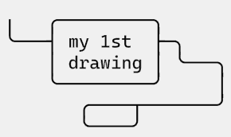

#+begin_example
 ╷   ╭─────────╮
 ╰───┤my first ├─╮
     │drawing  │ ╰───╮
     ╰─────────╯     │
        ╭────┬───────╯
        ╰────╯
#+end_example

* New
:PROPERTIES:
:CUSTOM_ID: new
:END:

Customization & settings now consistently available from the
application menu, from Hydra, and from Transient.

Type =<INS> *=.

* Table of Contents
:PROPERTIES:
:TOC:      :include all :depth 3 :force () :ignore (this) :local (nothing)
:CUSTOM_ID: table-of-contents
:END:

:CONTENTS:
- [[#getting-started-in-10-seconds][Getting started in 10 seconds]]
- [[#new][New]]
- [[#gallery-pure-unicode-diagrams-in-emacs][Gallery: pure UNICODE diagrams in Emacs]]
  - [[#document-a-command][Document a command]]
  - [[#connect-boxes-with-arrows][Connect boxes with arrows]]
  - [[#explain-decisions-trees][Explain decisions trees]]
  - [[#draw-lines-or-blocks][Draw lines or blocks]]
  - [[#outline-the-general-relativity-and-the-schrödingers-equations][Outline the General Relativity and the Schrödinger's equations]]
  - [[#explain-the-structure-of-a-sentence-in-a-foreign-language][Explain the structure of a sentence in a foreign language]]
  - [[#draw-electronic-diagrams][Draw electronic diagrams]]
  - [[#explain-lisp-lists][Explain Lisp lists]]
  - [[#draw-sketched-objects][Draw sketched objects]]
  - [[#pure-text][Pure text]]
  - [[#beware][Beware!]]
- [[#a-minor-mode-for-drawing][A minor mode for drawing]]
  - [[#minor-mode][Minor mode]]
  - [[#draw-lines-by-moving-the-cursor][Draw lines by moving the cursor]]
  - [[#infinite--buffer][Infinite ∞ buffer]]
  - [[#brush-style][Brush style]]
  - [[#text-direction][Text direction]]
- [[#the-insert-key][The <insert> key]]
- [[#glyphs-------insertion--modification][Glyphs ▷ ▶ → □ ◆ ╮─ insertion & modification]]
  - [[#arrows-glyphs------][Arrows glyphs ▷ ▶ → ▹ ▸ ↔]]
  - [[#intersection-glyphs---][Intersection glyphs ■ ◆ ●]]
  - [[#fine-tweaking-of-lines][Fine tweaking of lines]]
- [[#rectangular-actions][Rectangular actions]]
  - [[#drawing-a-rectangle][Drawing a rectangle]]
  - [[#filling-a-rectangle][Filling a rectangle]]
  - [[#moving-a-rectangular-region][Moving a rectangular region]]
  - [[#copying-killing-yanking-a-rectangular-region][Copying, killing, yanking a rectangular region]]
  - [[#dashed-lines-and-other-styles][Dashed lines and other styles]]
  - [[#ascii-to-unicode][ASCII to UNICODE]]
- [[#long-range-actions-contour-and-flood-fill][Long range actions: contour and flood-fill]]
  - [[#tracing-a-contour][Tracing a contour]]
  - [[#flood-fill][Flood-fill]]
- [[#macros][Macros]]
- [[#which-fonts][Which fonts?]]
  - [[#recommended-fonts][Recommended fonts]]
  - [[#use-case-mixing-fonts][Use case: mixing fonts]]
- [[#hydra-or-transient][Hydra or Transient?]]
  - [[#selecting-hydra-or-transient][Selecting Hydra or Transient]]
  - [[#instantly-selecting-hydra-or-transient][Instantly selecting Hydra or Transient]]
  - [[#one-liner-menus][One-liner menus]]
  - [[#the-hydra-interface][The Hydra interface]]
  - [[#the-transient-interface][The Transient interface]]
- [[#customization][Customization]]
  - [[#interface-type][Interface type]]
  - [[#insert-key][Insert key]]
  - [[#maximum-steps-when-drawing-a-contour][Maximum steps when drawing a contour]]
  - [[#cursor-type][Cursor type]]
  - [[#hint-style][Hint style]]
  - [[#welcome-message-visibility][Welcome message visibility]]
  - [[#line-spacing][Line spacing]]
  - [[#font][Font]]
  - [[#upward-infiniteness-][Upward infiniteness ∞]]
- [[#how-uniline-behaves-with-its-environment][How Uniline behaves with its environment?]]
  - [[#language-environment][Language environment]]
  - [[#compatibility-with-picture-mode][Compatibility with Picture-mode]]
  - [[#compatibility-with-artist-mode][Compatibility with Artist-mode]]
  - [[#compatibility-with-whitespace-mode][Compatibility with Whitespace-mode]]
  - [[#compatibility-with-org-mode][Compatibility with Org Mode]]
  - [[#org-mode-and-latex][Org Mode and LaTex]]
  - [[#what-about-t-tabs][What about \t tabs?]]
  - [[#what-about-l-page-separation][What about ^L page separation?]]
  - [[#emacs-on-the-linux-console][Emacs on the Linux console]]
  - [[#emacs-on-a-graphical-terminal-emulator][Emacs on a graphical terminal emulator]]
  - [[#emacs-on-windows][Emacs on Windows]]
  - [[#compatibility-with-asciiflow][Compatibility with ASCIIFlow]]
- [[#lisp-api][Lisp API]]
  - [[#move-the-cursor][Move the cursor]]
  - [[#brush][Brush]]
  - [[#example-lisp-function-to-draw-a-plus-sign][Example: Lisp function to draw a plus sign]]
  - [[#long-range-actions-contour-flood-fill-rectangle][Long range actions (contour, flood-fill, rectangle)]]
  - [[#constants][Constants]]
  - [[#macro-and-text-direction][Macro and text direction]]
  - [[#insert-and-tweak-glyphs][Insert and tweak glyphs]]
  - [[#change-to-alternate-styles][Change to alternate styles]]
- [[#mouse-support][Mouse support]]
- [[#installation][Installation]]
  - [[#use-package-the-straightforward-way][use-package, the straightforward way]]
  - [[#without-use-package][Without use-package]]
- [[#related-packages][Related packages]]
- [[#author-contributors][Author, contributors]]
- [[#license][License]]
:END:

* Gallery: pure UNICODE diagrams in Emacs
:PROPERTIES:
:CUSTOM_ID: gallery-pure-unicode-diagrams-in-emacs
:END:
Draw diagrams like those:

** Document a command
:PROPERTIES:
:CUSTOM_ID: document-a-command
:END:

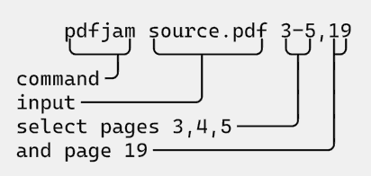

#+begin_example
   pdfjam source.pdf 3-5,9
  ╶─────▲────▲────────▲──▲╴
command╶╯    │        │  │
input file╶──╯        │  │
select pages 3,4,5╶───╯  │
and page 9╶──────────────╯
#+end_example

** Connect boxes with arrows
:PROPERTIES:
:CUSTOM_ID: connect-boxes-with-arrows
:END:

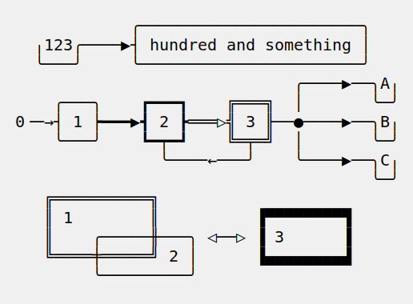

#+begin_example
            ╭───────────────────────╮
  ╷123╭────▶┤ hundred and something │
  ╰───╯     ╰───────────────────────╯
                             ╭────▶──╮A╷
    ╭───╮    ┏━━━┓    ╔═══╗  │       ╰─╯
0╶─→┤ 1 ┝━━━▶┫ 2 ┣═══▷╣ 3 ╟──●────▶──╮B╷
    ╰───╯    ┗━┯━┛    ╚═╤═╝  │       ╰─╯
               ╰────←───╯    ╰────▶──╮C╷
                                     ╰─╯
   ╔══════════╗
   ║ 1        ║          ▐▀▀▀▀▀▀▀▀▜
   ║    ╭─────╫───╮ ◁──▷ ▐ 3      ▐
   ╚════╪═════╝ 2 │      ▐▄▄▄▄▄▄▄▄▟
        ╰─────────╯
#+end_example

** Explain decisions trees
:PROPERTIES:
:CUSTOM_ID: explain-decisions-trees
:END:

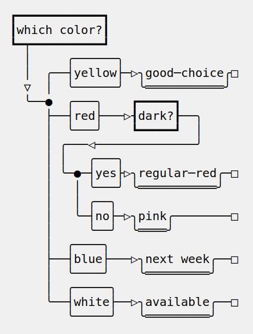

#+begin_example
  ┏━━━━━━━━━━━━┓
  ┃which color?┃
  ┗━┯━━━━━━━━━━┛
    │     ╭──────╮
    │  ╭──┤yellow├─▷╮good─choice╭□
    ▽  │  ╰──────╯  ╰═══════════╯
    ╰──●  ╭───╮    ┏━━━━━┓
       ├──┤red├───▷┨dark?┠──╮
       │  ╰───╯    ┗━━━━━┛  │
       │ ╭───◁──────────────╯
       │ │   ╭───╮
       │ ╰─●─┤yes├▷╮regular─red╭─□
       │   │ ╰───╯ ╰═══════════╯
       │   │ ╭──╮
       │   ╰─┤no├─▷╮pink╭────────□
       │     ╰──╯  ╰════╯
       │  ╭────╮
       ├──┤blue├───▷╮next week╭──□
       │  ╰────╯    ╰═════════╯
       │  ╭─────╮
       ╰──┤white├──▷╮available╭──□
          ╰─────╯   ╰═════════╯
#+end_example

** Draw lines or blocks
:PROPERTIES:
:CUSTOM_ID: draw-lines-or-blocks
:END:

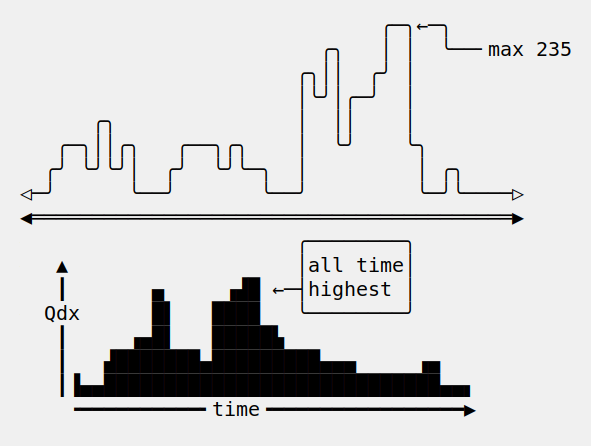

#+begin_example
                              ╭─╮←─╮
                         ╭╮   │ │  ╰──╴max 235
                       ╭╮││  ╭╯ │
                       │╰╯│╭─╯  │
      ╭╮               │  ││    │
   ╭─╮││╭╮   ╭──╮╭╮    │  ╰╯    ╰╮
  ╭╯ ╰╯╰╯│  ╭╯  ╰╯╰─╮  │         │ ╭╮
◁─╯      ╰──╯       ╰──╯         ╰─╯╰────▷
◀════════════════════════════════════════▶
                       ╭────────╮
   ▲                   │all time│
   ┃       ▄     ▗▟█ ←─┤highest │
  Qdx      █▌   ████   ╰────────╯
   ┃     ▗▄█▌   █████▙
   ┃   ▟███████▄█████████▄▄▄     ▗▄
   ┃▐▄▄████████████████████████████▄▄▖
    ╺━━━━━━━━━━╸time╺━━━━━━━━━━━━━━━━▶

#+end_example

** Outline the General Relativity and the Schrödinger's equations
:PROPERTIES:
:CUSTOM_ID: outline-the-general-relativity-and-the-schrödingers-equations
:END:

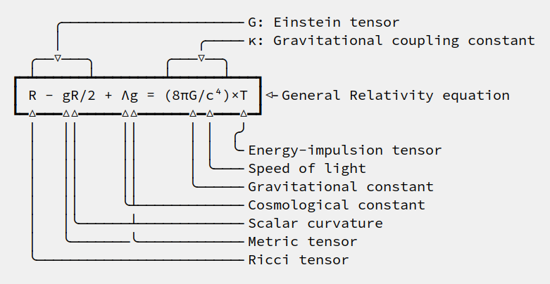

#+begin_example

       ╭─────────────────────╴G: Einstein tensor
       │                ╭────╴κ: Gravitational coupling constant
    ╭──▽───╮        ╭───▽──╮
  ┏━┷━━━━━━┷━━━━━━━━┷━━━━━━┷━━━┓
  ┃ R - gR/2 + Λg = (8πG/c⁴)×T ┃◁╴General Relativity equation
  ┗━△━━━△△━━━━━△△━━━━━━△━△━━━△━┛
    │   ││     ││      │ │  ╭╯
    │   ││     ││      │ │  ╰╴Energy-impulsion tensor
    │   ││     ││      │ ╰───╴Speed of light
    │   ││     ││      ╰─────╴Gravitational constant
    │   ││     ╰┴────────────╴Cosmological constant
    │   │╰──────┴────────────╴Scalar curvature
    │   ╰───────╰────────────╴Metric tensor
    ╰────────────────────────╴Ricci tensor

  #+end_example

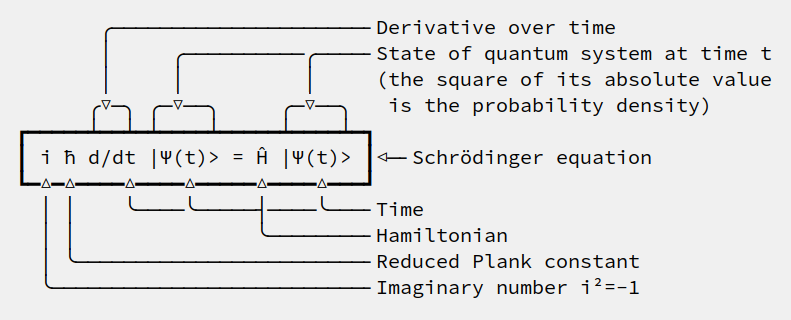

#+begin_example

         ╭─────────────────────╴Derivative over time
         │     ╭──────────╭────╴State of quantum system at time t
         │     │          │     (the square of its absolute value
        ╭▽─╮ ╭─▽──╮     ╭─▽──╮   is the probability density)
  ┏━━━━━┷━━┷━┷━━━━┷━━━━━┷━━━━┷━┓
  ┃ i ħ d/dt |Ψ(t)> = Ĥ |Ψ(t)> ┃◁─╴Schrödinger's equation
  ┗━△━△━━━━△━━━━△━━━━━△━━━━△━━━┛
    │ │    ╰────╰─────┤────╰───╴Time
    │ │               ╰────────╴Hamiltonian
    │ ╰────────────────────────╴Reduced Plank constant
    ╰──────────────────────────╴Imaginary number i²=-1

#+end_example

** Explain the structure of a sentence in a foreign language
:PROPERTIES:
:CUSTOM_ID: explain-the-structure-of-a-sentence-in-a-foreign-language
:END:
(which language?)

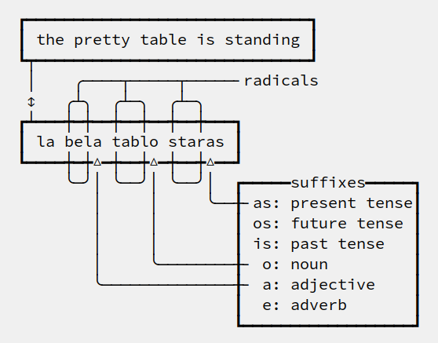

#+begin_example

   ┏━━━━━━━━━━━━━━━━━━━━━━━━━━━━━━┓
   ┃ the pretty table is standing ┃
   ┗┯━━━━━━━━━━━━━━━━━━━━━━━━━━━━━┛
    │    ╭────┬─────┬─────╴radicals
    ↕   ╭┴╮  ╭┴─╮  ╭┴─╮
   ┏┷━━━┿━┿━━┿━━┿━━┿━━┿━━━┓
   ┃ la bela tablo staras ┃
   ┗━━━━┿━┿△━┿━━┿△━┿━━┿△━━┛
        ╰─╯│ ╰──╯│ ╰──╯│  ┏━━━━━suffixes━━━━━┓
           │     │     ╰──╂╴as: present tense┃
           │     │        ┃ os: future tense ┃
           │     │        ┃ is: past tense   ┃
           │     ╰────────╂╴ o: noun         ┃
           ╰──────────────╂╴ a: adjective    ┃
                          ┃  e: adverb       ┃
                          ┗━━━━━━━━━━━━━━━━━━┛

#+end_example

** Draw electronic diagrams
:PROPERTIES:
:CUSTOM_ID: draw-electronic-diagrams
:END:

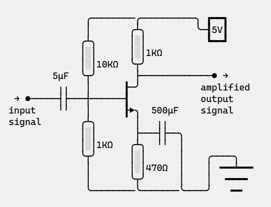

#+begin_example

               ╭────────╭──────────╮ ┏━━┓
               │       ╭┴╮         ╰─┨5V┃
              ╭┴╮      │░│           ┗━━┛
              │░│      │░│1KΩ
              │░│10KΩ  ╰┬╯
         5μF  ╰┬╯       ├─────────────● →
          ╷╷   │      ┠─╯           amplified
  → ●─────┤├───┼──────┨             output
 input    ╵╵   │      ┠▶╮  500μF    signal
 signal       ╭┴╮       │   ╷╷
              │░│       ├───┤├──╮
              │░│1KΩ   ╭┴╮  ╵╵  │
              ╰┬╯      │░│      │    ╭────╮
               │       │░│470Ω  │    │ ╺━━┷━━╸
               │       ╰┬╯      │    │  ╺━━━╸
               ╰────────╰───────╰────╯   ╺━╸

#+end_example

** Explain Lisp lists
:PROPERTIES:
:CUSTOM_ID: explain-lisp-lists
:END:

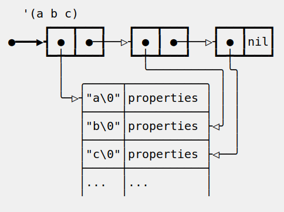

#+begin_example
  '(a b c)
     ┏━━━┳━━━┓   ┏━━━┳━━━┓   ┏━━━┳━━━┓
●━━━▶┫ ● ┃ ●─╂──▷┨ ● ┃ ●─╂──▷┨ ● ┃nil┃
     ┗━┿━┻━━━┛   ┗━┿━┻━━━┛   ┗━┿━┻━━━┛
       │           ╰──────────╮╰╮
       │  ╭─────┬───────────╮ │ │
       ╰─▷┤"a\0"│properties │ │ │
          ├─────┼───────────┤ │ │
          │"b\0"│properties ├◁╯ │
          ├─────┼───────────┤   │
          │"c\0"│properties ├◁──╯
          ├─────┼───────────┤
          │...  │...        │
          ╵     ╵           ╵
#+end_example

** Draw sketched objects
:PROPERTIES:
:CUSTOM_ID: draw-sketched-objects
:END:

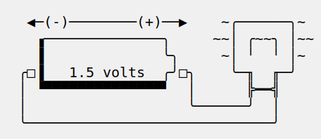

#+begin_example

  ◀─(-)────────(+)──▶    ~╭──────╮~
   ▗──────────────╮     ~~│ ╭~~╮ │~~
   ▐              ╰╮     ~│ ╵  ╵ │~
 ╭□▐   1.5 volts  ╭╯□╮    ╰─╖  ╓─╯
 │ ▝▀▀▀▀▀▀▀▀▀▀▀▀▀▀▘  │      ╠━━╣
 │                   ╰──────╯  │
 ╰─────────────────────────────╯
#+end_example

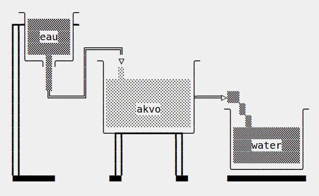

#+begin_example
   ╶╮       ╭╴
  ┏┳┥▒▒▒▒▒▒▒┝╸
  ┃┃│▒▒eau▒▒│
  ┃┃│▒▒▒▒▒▒▒│ ╔═════╗
  ┃┃╰──╮▒╭──╯ ║ ╶╮  ▽           ╭╴
  ┃┃    ▒     ║  │  ░           │
  ┃┃    ▒     ║  │░░░░░░░░░░░░░░│
  ┃┃    ╚═════╝  │░░░░░░░░░░░░░░╞════▷▒▒
  ┃┃             │░░░░░akvo░░░░░│    ╶╮ ▒         ╭╴
  ┃┃             │░░░░░░░░░░░░░░│     │  ▒        │
  ┃┃             ╰─┲┳━━━━━━━━┳┱─╯     │▒▒▒▒▒▒▒▒▒▒▒│
  ┃┃               ┃┃        ┃┃       │▒▒▒water▒▒▒│
  ┃┃               ┃┃        ┃┃       │▒▒▒▒▒▒▒▒▒▒▒│
  ┃┃               ┃┃        ┃┃       ╰───────────╯
  ▝▀▀▀▀▀▀▘        ▝▀▘        ▝▀▘      ▀▀▀▀▀▀▀▀▀▀▀▀▀
#+end_example

** Pure text
:PROPERTIES:
:CUSTOM_ID: pure-text
:END:

Those diagrams are pure text. There is nothing graphic. They are
achieved using UNICODE characters. Therefore they can be drawn within
any text formatted document, like Org Mode, Markdown, txt, comments in
any programming language source code (C++, Python, Rust, D,
JavaScript, GnuPlot, LaTex, whatever).

Most often, the text file will be encoded as UTF-8. This is becoming
the de-facto standard for text and source code files.

Creating such diagrams by hand is painfully slow. Use =Uniline= to
draw lines while you move the cursor with keyboard arrows.

** Beware!
:PROPERTIES:
:CUSTOM_ID: beware
:END:

If you see those diagrams miss-aligned, most likely the font used to
display them does not support UNICODE block characters. See bellow the
paragraph [[#which-fonts][Which fonts?]] for details.

If you get misalignment when drawing, this could come from too wide
characters. Emojis are an example. Usual characters may also be
considered twice as wide as normal under some "language
environments". See the paragraph [[#language-environment][Language environment]] for details.

* A minor mode for drawing
:PROPERTIES:
:CUSTOM_ID: a-minor-mode-for-drawing
:END:

** Minor mode
:PROPERTIES:
:CUSTOM_ID: minor-mode
:END:
=Uniline= is a minor mode. Activate it temporarily:

 =M-x uniline-mode=

Exit it with:

 =C-c C-c=

The current major mode is still active underneath =uniline-mode=.

While in =uniline-mode=, overwriting is active, as well as long lines
truncation. Also, a hollow cursor is provided (customizable). Those
settings are reset to their previous state when exiting =uniline-mode=.

** Draw lines by moving the cursor
:PROPERTIES:
:CUSTOM_ID: draw-lines-by-moving-the-cursor
:END:

Use keyboard arrows to draw lines.

By default, drawing lines only happens over empty space or over other
lines. If there is already text, it will not be erased. However, by
hitting the control-key while moving, lines overwrite whatever there
is.

The usual numeric prefix is available. For instance, to draw a line 12
characters wide downward, type: =M-12 <down>=

** Infinite ∞ buffer
:PROPERTIES:
:CUSTOM_ID: infinite--buffer
:END:

The buffer is infinite ∞ in the south and east directions. Which means
that when the cursor ends up outside the buffer, white space
characters are automatically added.

All algorithms also make use of the infiniteness of the buffer when
needed. Those algorithms are: moving a rectangle, pasting a rectangle,
drawing the external border of a rectangular region, or drawing the
contour of a shape.

The buffer is also infinite ∞ in the upward direction. That is
customizable through the =uniline-infinite-up↑= variable. If its value
is =t=, then the buffer is actually infinite ∞ upward. If it is =nil=,
then the upper border of the buffer is a hard limit. To customize,
type:

=M-x customize-variable uniline-infinite-up↑=

The buffer can be "narrowed", for instance with the =C-x n n= or =M-x
narrow-to-region= command. In this case, the limits are those of the
narrow region. When Uniline needs to bypass the up↑ or down↓ limits,
it adds empty lines. When widening again the buffer, the region which
was narrow will have increased.

** Brush style
:PROPERTIES:
:CUSTOM_ID: brush-style
:END:
Set the current brush with:

- ~-~ single thin line
  =╭─┬─╮=

- ~+~ single thick line
  =┏━┳━┓=

- ~=~ double line
  =╔═╦═╗=

- ~#~ quarter block
  =▙▄▟▀=

- =~= toggle dotted lines
  =┄┄┄┄=

- ~<delete>~ eraser

- ~<return>~ move without drawing anything

The current brush and the current text direction (see [[#text-direction][Text direction]]) are
reflected in the mode-line (at the bottom of the =Emacs= screen). It
looks like this:

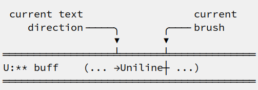

#+begin_example

  current text                  current
     direction╶────╮       ╭───╴brush
                   ▼       ▼
 ══════════════════╧═══════╧══════════════
 U:** buff    (... →Uniline┼ ...)
 ═════════════════════════════════════════

#+end_example

The dotted toggle ~~~ is a modifier for the single thin and thick
lines. It circles along 3 styles:
- plain lines,
- 3 dots vertical, 2 dots horizontal,
- 4 dots both vertical & horizontal,
- back to plain line and so on.

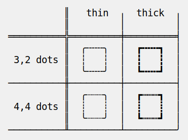

#+begin_example

            ║   thin  ╷  thick  ╷
            ║         │         │
  ══════════╬═════════╪═════════╡
            ║  ╭╌╌╌╮  │  ┏╍╍╍┓  │
   3,2 dots ║  ┆   ┆  │  ┇   ┇  │
            ║  ╰╌╌╌╯  │  ┗╍╍╍┛  │
  ──────────╫─────────┼─────────┤
            ║  ╭┈┈┈╮  │  ┏┉┉┉┓  │
   4,4 dots ║  ┊   ┊  │  ┋   ┋  │
            ║  ╰┈┈┈╯  │  ┗┉┉┉┛  │
  ──────────╨─────────┴─────────╯

#+end_example

Note that the UNICODE standard offers very limited support for dotted
lines. Only vertical and horizontal lines are available. So, no
crossing of line is possible. In case a line crosses a dotted line,
Uniline falls back to a plain line crossing character (but still
preserving thickness). There is no dotted versions of double lines
either.

** Text direction
:PROPERTIES:
:CUSTOM_ID: text-direction
:END:
Usually, inserting text in a buffer moves the cursor to the right. (And
sometimes to the left for some locales). Any of the 4 directions can be
selected under =Uniline=. Just type any of:

  - =<insert> C-<up>=
  - =<insert> C-<right>=
  - =<insert> C-<down>=
  - =<insert> C-<left>=

The current direction is reflected in the mode-line, just before the
word ="uniline"=.

* The =<insert>= key
:PROPERTIES:
:CUSTOM_ID: the-insert-key
:END:
The =<insert>= key is a prefix for other keys:
- for drawing arrows, squares, crosses, o-shapes glyphs,
- for handling rectangles,
- for inserting =# = - += which otherwise change the brush style,
- for trying a choice of mono-spaced fonts.

Why =<insert>=? Because:
- =Uniline= tries to leave their original meaning to as many keys as
  possible,
- the standard meaning of =<insert>= is to toggle the =overwrite-mode=;
  but =Uniline= is already in =overwrite-mode=, and de-activating
  overwrite would break =Uniline=.

So preempting =<insert>= does not sacrifice anything.

*Customization*

Another key may be defined instead of =<insert>=. Type:

#+begin_example
M-x customize-variable uniline-key-insert
#+end_example

* Glyphs =▷ ▶ → □ ◆ ╮─= insertion & modification
:PROPERTIES:
:CUSTOM_ID: glyphs-------insertion--modification
:END:

Individual character glyphs may be inserted and changed.
- Put the cursor where a glyphs should be edited or inserted.
- Then press =<insert>= (this key may be customized, see [[#insert-key][Insert key]]).

Arrows, squares, circles, crosses may be handled. Also lines may be
fine tweaked a single character at a time.

** Arrows glyphs =▷ ▶ → ▹ ▸ ↔=
:PROPERTIES:
:CUSTOM_ID: arrows-glyphs------
:END:
When inserting an arrow, it points in the direction that the line
drawing follows.

=Uniline= supports 6 arrows types: =▷ ▶ → ▹ ▸ ↔=

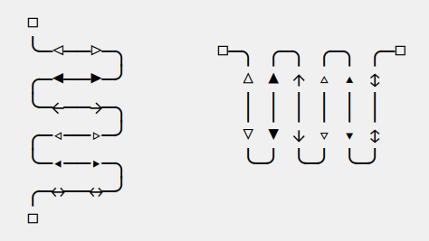

#+begin_example

   □
   ╰─◁──▷─╮       □─╮ ╭─╮ ╭─╮ ╭─□
   ╭─◀──▶─╯         △ ▲ ↑ ▵ ▴ ↕
   ╰─←──→─╮         │ │ │ │ │ │
   ╭─◃──▹─╯         ▽ ▼ ↓ ▿ ▾ ↕
   ╰─◂──▸─╮         ╰─╯ ╰─╯ ╰─╯
   ╭─↔──↔─╯
   □

#+end_example

Actually, there are tons of arrows of all styles in the UNICODE
standard. Unfortunately, support by fonts is weak. So =Uniline=
restrains itself to those six safe arrows.

To insert an arrow, type: =<insert> a= or =<insert> a a= or =<insert> a a a=. (=a=
cycles through the 6 styles, =A= cycles backward).

=<insert> 4 a= is equivalent to =<insert> a a a a=, which is also equivalent to
=<insert> A A A=. Those 3 shortcuts insert an arrow of this style: =▵▹▿◃=. The
actual direction where the arrow points follows the last movement of
the cursor.

To change the direction of the arrow, use shift-arrow, for example:
=S-<up>= will change from =→= to =↑=.

** Intersection glyphs =■ ◆ ●=
:PROPERTIES:
:CUSTOM_ID: intersection-glyphs---
:END:
There are a few UNICODE characters which are mono-space and symmetric
in the 4 directions. They are great at line intersections:

To insert a square =□ ■ ▫ ▪ ◆ ◊= type:
=<insert> s s s…= (=s= cycles, =S= cycles backward).

To insert a circular shape =· ∙ • ● ◦ Ø ø= type:
=<insert> o o o…= (=o= cycles, =O= cycles backward).

To insert a cross shape =╳ ╱ ╲ ÷ × ± ¤= type:
=<insert> x x x…= (=x= cycles, =X= cycles backward).

To insert a grey character =░▒▓█= from pure white to pure black type:
=<insert> SPC SPC SPC…= or =<insert> DEL DEL DEL…= (space key goes from
white to black, back-space key goes from black to white)

To insert a usual ASCII letter or symbol, just type it.

As the keys =- + = # ~= are preempted by =uniline-mode=, to type them,
prefix them with =<insert>=. Example: =<insert> -= inserts a =-= and
=<insert> += inserts a =+=.

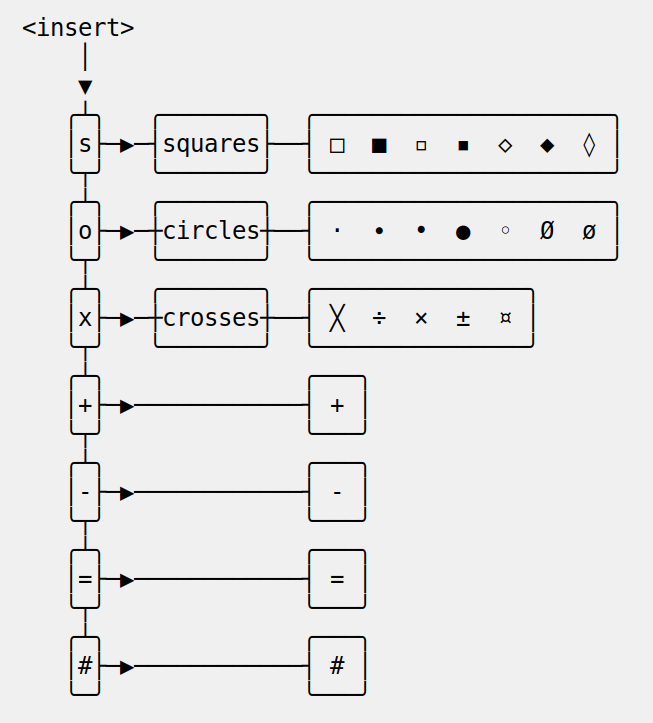

#+begin_example

 <insert>
    │
    ├────────────────────────────╮
    ▼        ╭─arrows──────╮     ▼        ╭───╮
    ╰──▶─(a)─┤ ▷ ▶ → ▹ ▸ ↔ │     ╰──▶─(+)─┤ + │
    │        ╰─────────────╯     │        ╰───╯
    │        ╭─squares─────╮     │        ╭───╮
    ╰──▶─(s)─┤ □ ■ ▫ ▪ ◆ ◊ │     ╰──▶─(-)─┤ - │
    │        ╰─────────────╯     │        ╰───╯
    │        ╭─circles───────╮   │        ╭───╮
    ╰──▶─(o)─┤ · ∙ • ● ◦ Ø ø │   ╰──▶─(=)─┤ = │
    │        ╰───────────────╯   │        ╰───╯
    │        ╭─crosses───────╮   │        ╭───╮
    ╰──▷─(x)─┤ ╳ ╱ ╲ ÷ × ± ¤ │   ╰──▶─(#)─┤ # │
    │        ╰───────────────╯   │        ╰───╯
    │              ╭───────╮     │        ╭───╮
    ╰──▶─(SPC DEL)─┤  ░▒▓█ │     ╰──▶─(~)─┤ ~ │
                   ╰───────╯              ╰───╯

#+end_example

** Fine tweaking of lines
:PROPERTIES:
:CUSTOM_ID: fine-tweaking-of-lines
:END:

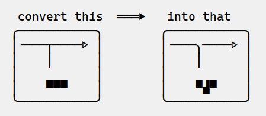

#+begin_example

    convert this  ═══▶   into that
   ╭───────────╮        ╭───────────╮
   │╶───┬────▷ │        │╶───╮────▷ │
   │    │      │        │    │      │
   │           │        │           │
   │    ▀▀▀    │        │    ▀▟▀    │
   ╰───────────╯        ╰───────────╯

#+end_example

At the crossing of lines, it may be appealing to do small
adjustments. In the above example, we removed a segment of line which
occupies 1/4 of a character. This cannot be achieve with line tracing
alone. We also modified a quarter-block line in a non-obvious way.

- Put the point (the cursor) on the character where lines cross each other.
- type =INS S-<right> S-<right>=

=<right>= here refers to the right part of the character under the
point. The 1/4 line segment will cycle through all displayable
forms. On the second stroke, no segment will be displayed, which is
what we want.

Caveat! The UNICODE standard does not define all possible combinations
including double line segments. (It does for all combinations of thin
and tick lines). So sometimes, when working with double lines, the
process may be frustrating.

This works also for lines made of quarter-blocks. There are 4
quarter-blocks in a character, either on or off. Each of the 4 shifted
keyboard arrows flips a quarter-block on-and-off.

In the above example, the effect was achieved with:
=INS S-<up> S-<down> S-<left>=

* Rectangular actions
:PROPERTIES:
:CUSTOM_ID: rectangular-actions
:END:

- Drawing,
- filling,
- moving,
- copying & yanking,
- change line & glyph styles,

those actions may be performed on a rectangular selection.

Select a rectangular region with =C-SPC= or =C-x SPC= and move the cursor.

You may also use =S-<arrow>= (=<arrow>= being any of the 4
directions) to extend the selection. The buffer grows as needed with
white spaces to accommodate the selection. Selection extension mode is
active when =shift-select-mode= is non-nil.

Or you may use the mouse to highlight the desired region.

All those region-highlighting are standard in =Emacs=, and unrelated to
=Uniline=.

Once you have a region highlighted, press =<insert>= (this key can be
customized, see [[#insert-key][Insert key]]). The selection becomes rectangular if it
was not. You are offered a menu of possible actions.

** Drawing a rectangle
:PROPERTIES:
:CUSTOM_ID: drawing-a-rectangle
:END:

To draw a rectangle in one shot, select a region, press =<insert>=, then
hit:
- =r= to draw a rectangle inside the selection
- =S-R= to draw a rectangle outside the selection
- =C-r= to overwrite a rectangle inside the selection
- =C-S-R= to overwrite a rectangle outside the selection

If needed, change the brush with any of =- + = # <delete>=

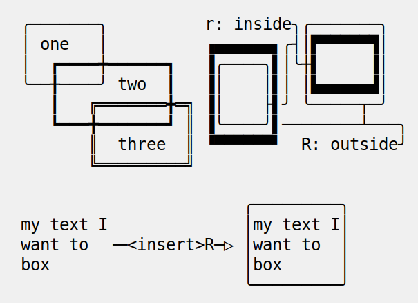

#+begin_example
   ╭───────╮          r: inside╮╭───────╮
   │ one   │          ▗▄▄▄▄▄▄▖╭┤│▛▀▀▀▀▀▜│
   │  ┏━━━━┿━━━━━━┓   ▐╭────╮▌│╰┼▌     ▐│
   ╰──╂────╯ two  ┃   ▐│    │▌│ │▙▄▄▄▄▄▟│
      ┃   ╔═══════╋═╗ ▐│    ├▌╯ ╰─────┬─╯
      ┗━━━╋━━━━━━━┛ ║ ▐╰────╯▌────────┴───╮
          ║  three  ║ ▝▀▀▀▀▀▀▘  R: outside╯
          ╚═════════╝

                          ╭─────────╮
   my text I              │my text I│
   want to  ╶─<insert>R─▷ │want to  │
   box                    │box      │
                          ╰─────────╯
#+end_example

The usual =C-_= or =C-/= keys may be hit to undo, even with the region
still active visually.

** Filling a rectangle
:PROPERTIES:
:CUSTOM_ID: filling-a-rectangle
:END:

While the rectangular mode is active, press =i= to fill the
rectangle. You will be asked to choose a character. You have those
options:

- for a regular character like =t=, just type it.
- =SPC= or =DEL= for a shade of grey =" ░▒▓█"= among the 5 available in
  UNICODE. =SPC= to make it darker and darker. =DEL= to make the rectangle
  lighter and lighter.
- =C-y= to chose the first character in the top of the kill ring.

The above selection is the same as for the flood-fill action (see
[[#flood-fill][Flood-fill]]).

** Moving a rectangular region
:PROPERTIES:
:CUSTOM_ID: moving-a-rectangular-region
:END:
Select a region, then press =<insert>=.

Use arrow keys to move the rectangle around. A numeric prefix may be
used to move the rectangle that many characters.
- Under =Hydra=, be sure to specify the numeric prefix with just digits,
  without the =Alt= key. Typing =15 <left>= moves the rectangle 15
  characters to the left. =M-15 <left>= does not work.
- Under =Transient=, use the =Alt= key, like anywhere else in =Emacs=. Type
  =M-15 <left>= to move the selected rectangle 15 characters to the left.

Press =q=, =<return>=, or =C-g= to stop moving the rectangle.

The =C-_= key may also be used to undo the previous movements, even
though the selection is still active.

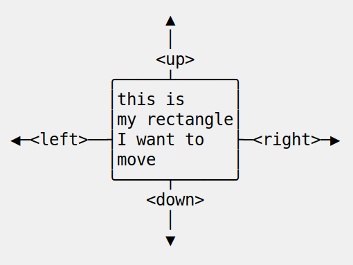

#+begin_example
                 ▲
                 │
                <up>
           ╭─────┴──────╮
           │this is     │
           │my rectangle│
 ◀─<left>──┤I want to   ├─<right>─▶
           │move        │
           ╰─────┬──────╯
               <down>
                 │
                 ▼
#+end_example

What is leakage? When moving a rectangular region, the rectangle
leaves behind lines oriented in the movement direction. This is not a
bug, but a feature. Leakage allows growing a drawing without breaking
it in two parts.

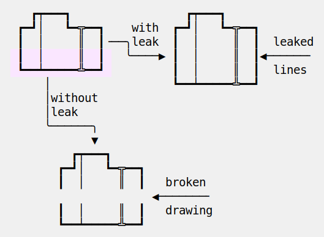

#+begin_example

      ┏┯━━━┓                 ┏┯━━━┓
    ┏━┛│   ┗━╦━━┓    with  ┏━┛│   ┗━╦━━┓
    ┃  │     ║  ┃╶──╮leak  ┃  │     ║  ┃  leaked
    ┃  │     ║  ┃   ╰────▶ ┃  │     ║  ┃◀──────╴
    ┗━━┷━━━━━╩━━┛          ┃  │     ║  ┃  lines
        │                  ┗━━┷━━━━━╩━━┛
        │without
        │leak
        ╰──────╮
               ▼
            ┏┯━━━┓
          ┏━┛│   ┗━╦━━┓
          ┃  │     ║  ┃   broken
                        ◀───────╴
          ┃  │     ║  ┃   drawing
          ┗━━┷━━━━━╩━━┛

#+end_example

** Copying, killing, yanking a rectangular region
:PROPERTIES:
:CUSTOM_ID: copying-killing-yanking-a-rectangular-region
:END:

A rectangle can be copied or killed, then yanked somewhere else.

Select a region, press =<insert>=, then:
- =c= to copy
- =k= to kill
- =y= to yank (aka paste)

This is similar to the =Emacs= standard rectangle handling:
- =C-x r r= copy rectangle to register
- =C-x r k= kill rectangle
- =C-x r y= yank killed rectangle

The first difference is that =Uniline= rectangles, when killed and
yanked, do not move surrounding characters.

The second difference is that the white characters of the yanked
rectangle are considered transparent. As a result, only non-blank
parts of the yanked rectangle are over-printed.

=Uniline= and =Emacs= standard rectangle share the same storage for copied
and killed rectangles, namely the =killed-rectangle= Lisp variable. So,
a rectangle can be killed one way, and yanked another way.

** Dashed lines and other styles
:PROPERTIES:
:CUSTOM_ID: dashed-lines-and-other-styles
:END:

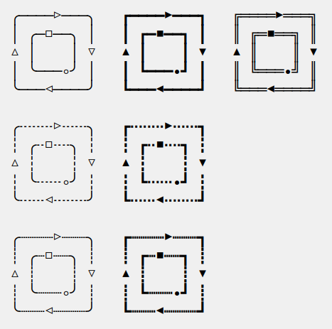

#+begin_example

   ╭────▷───╮   ┏━━━━▶━━━┓   ╔════▶═══╗
   │ ╭─□──╮ │   ┃ ┏━■━━┓ ┃   ║ ╔═■══╗ ║
   △ │    │ ▽   ▲ ┃    ┃ ▼   ▲ ║    ║ ▼
   │ ╰───◦╯ │   ┃ ┗━━━•┛ ┃   ║ ╚═══•╝ ║
   ╰───◁────╯   ┗━━━◀━━━━┛   ╚═══◀════╝

   ╭╌╌╌╌▷╌╌╌╮   ┏╍╍╍╍▶╍╍╍┓
   ┆ ╭╌□╌╌╮ ┆   ┇ ┏╍■╍╍┓ ┇
   △ ┆    ┆ ▽   ▲ ┇    ┇ ▼
   ┆ ╰╌╌╌◦╯ ┆   ┇ ┗╍╍╍•┛ ┇
   ╰╌╌╌◁╌╌╌╌╯   ┗╍╍╍◀╍╍╍╍┛

   ╭┈┈┈┈▷┈┈┈╮   ┏┉┉┉┉▶┉┉┉┓
   ┊ ╭┈□┈┈╮ ┊   ┋ ┏┉■┉┉┓ ┋
   △ ┊    ┊ ▽   ▲ ┋    ┋ ▼
   ┊ ╰┈┈┈◦╯ ┊   ┋ ┗┉┉┉•┛ ┋
   ╰┈┈┈◁┈┈┈┈╯   ┗┉┉┉◀┉┉┉┉┛

#+end_example

A base drawing can be converted to dashed lines. Moreover, lines can
be made either thin or thick.

- Select the rectangular area you want to operate on (with mouse drag
  or =S-<left>=, =S-<down>= and so on as described earlier).
- Type =INS=, then =s= (as "style").

You will be offered a choice of styles:
- =3=: vertical lines will become 3 dashes per character, while
  horizontal ones will get 2 dashes per character.
- =4=: vertical and horizontal lines will get 4 dashes per character.
- =h=: thin lines corners, which are usually rounded, become hard angles.
- =+=: thin lines and intersections become thick, empty glyphs get
  filled.
- =-=: thick lines and intersections become thin, filled glyphs are
  emptied.
- ~=~: thick and thin lines become double lines.
- =0=: come back to standard base-line =Uniline= style: plain, not-dashed
  lines, thin corner rounded, ASCII art is converted to UNICODE.
- =a=: apply the =aa2u-rectangle= function from the unrelated
  =ascii-art-to-unicode= package, to convert ASCII art to UNICODE (this
  only works if =ascii-art-to-unicode= is already installed).

Converting parts of a drawing from one style to another can produce
nice looking sketches.

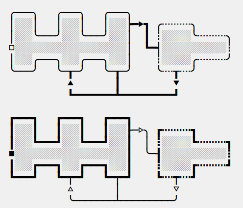

#+begin_example

   ╭───╮   ╭───╮   ╭───╮
   │░░░│   │░░░│   │░░░┝━▶┓ ╭╌╌╌╌╌╮
   │░░░╰───╯░░░╰───╯░░░│  ┃ ┆░░░░░╰╌╌╌╌╌╮
   □░░░░░░░░░░░░░░░░░░░│  ┗━┥░░░░░░░░░░░┆
   │░░░╭───╮░░░╭───╮░░░│    ┆░░░░░╭╌╌╌╌╌╯
   ╰───╯   ╰─┰─╯   ╰─┰─╯    ╰╌╌┰╌╌╯
             ▲       ┃         ▼
             ┗━━━━━━━┻━━━━━━━━━┛

   ┏━━━┓   ┏━━━┓   ┏━━━┓
   ┃░░░┃   ┃░░░┃   ┃░░░┠─▷╮ ┏╍╍╍╍╍┓
   ┃░░░┗━━━┛░░░┗━━━┛░░░┃  │ ┇░░░░░┗╍╍╍╍╍┓
   ■░░░░░░░░░░░░░░░░░░░┃  ╰─┨░░░░░░░░░░░┇
   ┃░░░┏━━━┓░░░┏━━━┓░░░┃    ┇░░░░░┏╍╍╍╍╍┛
   ┗━━━┛   ┗━┯━┛   ┗━┯━┛    ┗╍╍┯╍╍┛
             △       │         ▽
             ╰───────┴─────────╯

#+end_example

** ASCII to UNICODE
:PROPERTIES:
:CUSTOM_ID: ascii-to-unicode
:END:

The standard base-line =Uniline= (=INS s 0=) or =aa2u-rectangle= (=INS s a=)
conversions may be used to convert ASCII art to UNICODE. The original
ASCII art may be drawn for instance by the =artist-mode= or the
=picture-mode= packages.

To use =aa2u-rectangle=, install the =ascii-art-to-unicode= package by
Thien-Thi Nguyen (RIP), available on ELPA. =Uniline= does not requires a
dependency on this package, by lazy evaluating any call to
=aa2u-rectangle=.
See https://elpa.gnu.org/packages/ascii-art-to-unicode.html

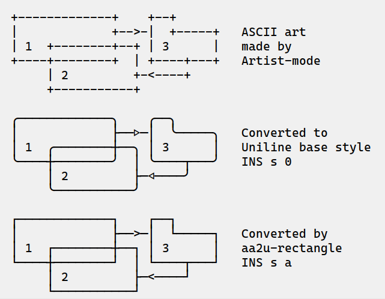

#+begin_example

  +-------------+    +--+
  |             +-->-|  +-----+   ASCII art
  | 1  +--------+--+ | 3      |   made by
  +----+--------+  | +----+---+   Artist-mode
       | 2         +-<----+
       +-----------+

  ╭─────────────╮    ╭──╮
  │             ├──▷─│  ╰─────╮   Converted to
  │ 1  ╭────────┼──╮ │ 3      │   Uniline base style
  ╰────┼────────╯  │ ╰────┬───╯   INS s 0
       │ 2         ├─◁────╯
       ╰───────────╯

  ┌─────────────┐    ┌──┐
  │             ├──>─│  └─────┐   Converted by
  │ 1  ┌────────┼──┐ │ 3      │   aa2u-rectangle
  └────┼────────┘  │ └────┬───┘   INS s a
       │ 2         ├─<────┘
       └───────────┘
#+end_example

=INS s 0= with selection active calls the =uniline-change-style-standard=
function. It converts what looks ASCII-art to UNICODE-art. Of course,
there are ambiguities regarding whether a character is part of a
sketch or not.

The heuristic is to consider that a character is part of a sketch if
it is surrounded by at least one other character which is part of a
sketch. So, an isolated =-= minus character will be left alone, while
two such characters =--= will be converted to UNICODE. Conversion will
happens also for =<-= for instance.

Here is a fairly convoluted ASCII-art example, along with its
conversion by =INS s 0=:

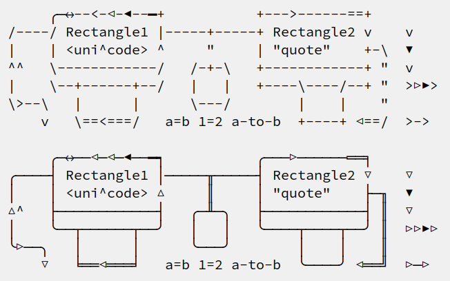

#+begin_example

       ╭─↔--<-◁-◀--━+           +--->------==+
  /----/ Rectangle1 |-----+-----+ Rectangle2 v    v
  |    | <uni^code> ^     "     | "quote"    +-\  ▼
  ^^   \------------/   /-+-\   +------------+ "  v
  |    \--+------+--/   |   |   +----\----/--+ "  >▷▶>
  \>--\   |      |      \---/        |    |    "
      v   \==<===/   a=b 1=2 a-to-b  +----+ ◁==/  >->

       ╭─↔──◁─◁─◀──━┑           ╭───▷──────══╕
  ╭────┤ Rectangle1 │─────╥─────┤ Rectangle2 ▽    ▽
  │    │ <uni^code> △     ║     │ "quote"    ├─╖  ▼
  △^   ├────────────┤   ╭─╨─╮   ├────────────┤ ║  ▽
  │    ╰──┬──────┬──╯   │   │   ╰────┬────┬──╯ ║  ▷▷▶▷
  ╰▷──╮   │      │      ╰───╯        │    │    ║
      ▽   ╘══◁═══╛   a=b 1=2 a-to-b  ╰────╯ ◁══╝  ▷─▷

#+end_example

* Long range actions: contour and flood-fill
:PROPERTIES:
:CUSTOM_ID: long-range-actions-contour-and-flood-fill
:END:
** Tracing a contour
:PROPERTIES:
:CUSTOM_ID: tracing-a-contour
:END:

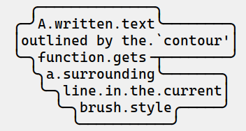

#+begin_example
    ╭──────────────╮
  ╭─╯A.written.text╰────────╮
  │outlined by the.`contour'│
  ╰─╮function.gets╶┬────────╯
    ╰╮a.surrounding╰───────╮
     ╰─╮line.in.the.current│
       ╰─╮brush.style╭─────╯
         ╰───────────╯
#+end_example

Choose or change the brush style with any of =-,+,=_,#,<delete>=. Put
the cursor anywhere on the shape or outside but touching it. Then
type:

=<insert> c=

A contour line is traced (or erased if brush style is =<delete>=)
around the contiguous shape close to the cursor.

When hitting capital letter: =<insert> S-C= the contour is
overwritten. This means that if there was already a different style of
line on the contour path, it is overwritten.

The shape is distinguished because it floats in a blank characters
ocean. For the shake of the contour function, blank characters are
those containing lines as drawn by =Uniline= (including true blank
characters). Locations outside the buffer are also considered blank.

The algorithm has an upper limit of =10000= steps. This avoids an
infinite loop in which the algorithm may end up in some rare
cases. One of those cases is when the contour crosses a new-page
character, displayed by =Emacs= as =^L=. =10000= steps require a fraction of
a second to run. For shapes really huge, you may launch the contour
command once again, at the point where the previous run ended.

This =10000= steps limit is customizable. Type:

#+begin_example
M-x customize-variable uniline-contour-max-steps
#+end_example

** Flood-fill
:PROPERTIES:
:CUSTOM_ID: flood-fill
:END:

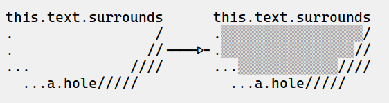

#+begin_example

 this.text.surrounds      this.text.surrounds
 .                 /      .▒▒▒▒▒▒▒▒▒▒▒▒▒▒▒▒▒/
 .                //╶───▷╴.▒▒▒▒▒▒▒▒▒▒▒▒▒▒▒▒//
 ...            ////      ...▒▒▒▒▒▒▒▒▒▒▒▒////
   ...a.hole/////           ...a.hole/////

#+end_example

A hollow shape is a contiguous region of identical characters (not
necessarily blank), surrounded by a boundary of different
characters. The end of the buffer in any direction is also considered
a boundary.

Put the cursor anywhere in the hole. Then type:

=<insert> i=

Answer by giving a character to fill the hole.

If instead of a character, =SPC= or =DEL= is typed, then a shade of grey
character is picked. =SPC= selects a darker grey than the one the point
is on, while =DEL= selects a lighter. There are 5 shades of grey in the
UNICODE standard: =" ░▒▓█"=.  Those grey characters are well supported
by the suggested fonts.

=C-y= is also an option. The first character in the top of the kill
ring will be chosen as the filling character. (The kill ring is filled
by functions like =C-k= or =M-w=, unrelated to =Uniline=).

Typing =<return>= or =C-g= aborts the filling operation.

A rectangular shape may also be filled.
- Mark a region
- =<insert> i=
- answer which character should be used to fill.

There is no limit on the area to fill. Therefore, the filling
operation may flood the entire buffer (but no more).

* Macros
:PROPERTIES:
:CUSTOM_ID: macros
:END:
=Uniline= adds directional macros to the =Emacs= standard macros.

Record a macro as usual with =C-x (= … =C-x )=.

Then call it with the usual =C-x e=. But then, instead of executing
the macro, a menu is offered to execute it in any of the 4 directions.

When a macro is executed in a direction other than the one it was
recorded, it is twisted in that direction. This means that recorded
hits on the 4 keyboard arrows are rotated. It happens also for shift
and control variations of those keys. Direction of text insertion is
also rotated.

There is still the classical =e= option to call the last recorded
macro. So instead of the usual =C-x e=, type =C-x e e=. And of course,
the usual repetition typing repeatedly =e= is available.

Why are directional macros useful? To create fancy lines. For
instance, if we want a doted-line instead of the continuous one, we
record a macro for one step:

#+begin_example
C-x (             ;; begin recording
INS o             ;; insert a small dot
<right> <right>   ;; draw a line over 2 characters
C-x )             ;; stop recording
#+end_example

Then we call this macro repeatedly in any of the 4 directions:

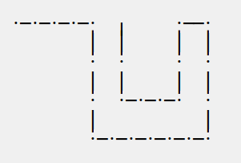

#+begin_example

   ·─·─·─·─·  ╷     ·──·
           │  │     │  │
           ·  ·     ·  ·
           │  │     │  │
           ·  ·─·─·─·  ·
           │           │
           ·─·─·─·─·─·─·

#+end_example

We can draw complex shapes by just drawing one step. Hereafter, we
call a macro in 4 directions, closing a square:

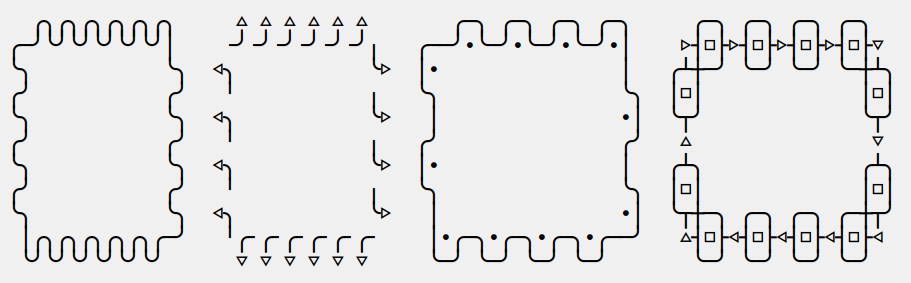

#+begin_example

   ╭╮╭╮╭╮╭╮╭╮╭╮     △ △ △ △ △ △       ╭─╮ ╭─╮ ╭─╮ ╭─╮     ╭─╮ ╭─╮ ╭─╮ ╭─╮
 ╭─╯╰╯╰╯╰╯╰╯╰╯│    ╶╯╶╯╶╯╶╯╶╯╶╯╷   ╭──╯∙╰─╯∙╰─╯∙╰─╯∙│    ▷┤□├▷┤□├▷┤□├▷┤□├▽
 ╰╮           ╰╮  ◁╮           ╰▷  │∙               │   ╭┴┼─╯ ╰─╯ ╰─╯ ╰─┼┴╮
 ╭╯           ╭╯   ╵           ╷   ╰╮               ╰╮  │□│             │□│
 ╰╮           ╰╮  ◁╮           ╰▷   │               ∙│  ╰┬╯             ╰┬╯
 ╭╯           ╭╯   ╵           ╷   ╭╯               ╭╯   △               ▽
 ╰╮           ╰╮  ◁╮           ╰▷  │∙               │   ╭┴╮             ╭┴╮
 ╭╯           ╭╯   ╵           ╷   ╰╮               ╰╮  │□│             │□│
 ╰╮           ╰╮  ◁╮           ╰▷   │               ∙│  ╰┬┼─╮ ╭─╮ ╭─╮ ╭─┼┬╯
  │╭╮╭╮╭╮╭╮╭╮╭─╯   ╵╭╴╭╴╭╴╭╴╭╴╭╴    │∙╭─╮∙╭─╮∙╭─╮∙╭──╯   △┤□├◁┤□├◁┤□├◁┤□├◁
  ╰╯╰╯╰╯╰╯╰╯╰╯      ▽ ▽ ▽ ▽ ▽ ▽     ╰─╯ ╰─╯ ╰─╯ ╰─╯       ╰─╯ ╰─╯ ╰─╯ ╰─╯

#+end_example

* Which fonts?
:PROPERTIES:
:CUSTOM_ID: which-fonts
:END:
A mono-space character font must be used. It must also support UNICODE.

** Recommended fonts
:PROPERTIES:
:CUSTOM_ID: recommended-fonts
:END:

Not all fonts are born equal.

- =(set-frame-font "DejaVu Sans Mono"        )=
- =(set-frame-font "Unifont"                 )=
- =(set-frame-font "Hack"                    )=
- =(set-frame-font "JetBrains Mono"          )=
- =(set-frame-font "Cascadia Mono"           )=
- =(set-frame-font "Agave"                   )=
- =(set-frame-font "JuliaMono"               )=
- =(set-frame-font "FreeMono"                )=
- =(set-frame-font "Iosevka Comfy Fixed"     )=
- =(set-frame-font "Iosevka Comfy Wide Fixed")=
- =(set-frame-font "Aporetic Sans Mono"      )=
- =(set-frame-font "Aporetic Serif Mono"     )=
- =(set-frame-font "Source Code Pro"         )=

Those fonts are known to support the required UNICODE characters, AND
display them as mono-space. There are fonts advertised as mono-space
which give arbitrary widths to non-ASCII characters. That is bad for
the kind of drawings done by =Uniline=.

You may want to try any of the suggested fonts. Just hit the
corresponding entry in the =Uniline= menu, or type =<insert> f=. You may
also execute the above Lisp commands like that:

=M-: (set-frame-font "DejaVu Sans Mono")=

This setting is for the current session only. If you want to make it
permanent, you may use the =Emacs= customization:

=<insert> f *=

or

=M-x customize-face default=

Beware that =Emacs= tries to compensate for missing UNICODE support by
the current font. =Emacs= substitutes one font for another, character
per character. The user may not notice until the drawings done under
=Emacs= are displayed on another text editor or on the Web. Of course,
using the suggested fonts and the UNICODEs drawn by =Uniline= keeps you
away from those glitches.

To know which font =Emacs= has chosen for a given character, type:

=C-u C-x ==

Note that none of those commands downloads a font from the Web.
The font should already be available.

** Use case: mixing fonts
:PROPERTIES:
:CUSTOM_ID: use-case-mixing-fonts
:END:

A user on GitHub, dmullis, exposed his use-case. A source-code base is
usually edited with a font not in the Uniline list of recommended
fonts. However, it is desirable to document the source code with
Uniline, either directly along the source or in separate files. How to
achieve that without messing with the fonts in several Emacs buffers?

Several solutions have emerged from the discussion.

- =face-remap-add-relative=

A line like this at the top of the files reserved for Uniline drawings:

#+begin_example
-*- eval: (face-remap-add-relative 'default :family "DejaVu Sans Mono"); -*-
#+end_example

This confines its effect to just the one single buffer.

- =uniline-mode-hook=

Add a hook (a function called when entering =uniline-mode=):

#+begin_example
(add-hook
  'uniline-mode-hook
  (lambda () (face-remap-add-relative 'default :family "DejaVu Sans Mono")))
#+end_example

There are also =uniline-mode-on-hook= & =uniline-mode-off-hook= which can be handy.

- =font-lock-comment-face=

An alternative mean of limiting the scope of the font change is the
Emacs standard font-lock mechanism.

#+begin_example
(customize-face '(font-lock-comment-face))
#+end_example

Then check =Font Family=, type in value ="DejaVu Sans Mono",= and =C-x C-s=.

Now any major mode that understands "comments" as distinct from other
text can safely nest a Uniline drawing within its boundaries, all text
outside the "comment" unaffected (except perhaps by spacing).

Look also at the =font-lock-constant-face= face.

- Org Mode

In Org Mode, the usable faces could be =org-block=, =org-quote=,
=org-verse=. But first the =org-fontify-quote-and-verse-blocks= variable
must be set to =t=.

- Markdown

In Markdown mode, customize the =markdown-pre-face= or
=markdown-code-face= faces.

* Hydra or Transient?
:PROPERTIES:
:CUSTOM_ID: hydra-or-transient
:END:
The basic usage of =Uniline= should be easy: just move the point, and lines
are traced. Change brush to draw thicker lines.

More complex actions are summoned by the =<insert>= key, with or without
selection. This is a single key to remember. Then a textual menu is
displayed, giving the possible keys continuations and their
meaning. All that is achieved by the =Hydra= or =Transient= libraries,
which are now part of =Emacs= (thanks!).

The =Hydra= and =Transient= libraries offer similar features. Some users
may prefer one or the other.

=Uniline= was developed from day one with =Hydra=. =Transient= is a late
addition.

** Selecting Hydra or Transient
:PROPERTIES:
:CUSTOM_ID: selecting-hydra-or-transient
:END:

Two files are compiled when installing =Uniline=
- =uniline-hydra.el=
- =uniline-transient.el=

One of them should be loaded (but not both). There are several
ways. The cleanest is =use-package=. Add those lines to your =~/.emacs=
file:

#+begin_src elisp
(use-package uniline-hydra
  :bind ("C-<insert>" . uniline-mode))
#+end_src

or:

#+begin_src elisp
(use-package uniline-transient
  :bind ("C-<insert>" . uniline-mode))
#+end_src

The following key sequences can assist in modifying the =.emacs= file:
- =<INS> * H=
- =<INS> * T=

Note: there used to be a customizable setting to switch between the
two interfaces. This had many issues. One of them is that the
native-compiler is blind to all user-customized settings.

There is a third file, =uniline-code.elc=. Loading =uniline-hydra.elc= or
=uniline-transient.elc= automatically loads =uniline-core.elc=.

** Instantly selecting Hydra or Transient
:PROPERTIES:
:CUSTOM_ID: instantly-selecting-hydra-or-transient
:END:
It is now possible to switch user interfaces on the fly.

To do so, look at the "Customize" entry in the Uniline menu. This
menu is available:
- from the menu-bar at the top of the Emacs screen (if not made
  invisible),
- by left-clicking on ="Uniline"= in the mode-line, at the bottom of the
  Emacs screen.

Note that the changes are for the current session only. To permanently
choose Hydra or Transient, change your =~/.emacs=initialization file
as describe in [[#selecting-hydra-or-transient][Selecting Hydra or Transient]].

The actions performed by the menu are:
- =(load-library "uniline-hydra")=
- =(load-library "uniline-transient")=

You can execute them directly or by other means.

** One-liner menus
:PROPERTIES:
:CUSTOM_ID: one-liner-menus
:END:
The multi-lines menus in Hydra and Transient are quite useful for
casual users. For seasoned users, those huge textual menus may
distract them from their workflow.

It is now possible to switch to less distracting textual menus. They
are displayed in the echo-area on a single line.

To do so, type:
- =C-t= within a sub-mode (glyph insertion mode, rectangle handling,
  etc.)
- =C-h TAB= at the top-level.

This will flip between the two sizes of textual menus. It also affects
the welcome message, the one displayed when entering the =Uniline= minor
mode.

The current size is controlled by the =uniline-hint-style= variable:
- =t= for full fledged messages over several lines
- =1= for one-liner messages
- =0= for no message at all

The variable is "buffer-local", which means that it can take distinct
values on distinct buffers.

Its default value can be customized and saved for future sessions:

=M-x customize-variable uniline-hint-style=

After customization it can be changed later, on a buffer per buffer
basis, with the =C-t= or =C-h TAB= keys.

Transient natively offers a similar setting:
=transient-show-popup=. (There is no such variable in Hydra). It can be
customized with =t=, =nil=, =0= (zero), or a number. This is similar but not
exactly the same as the Hydra behavior and the =uniline-hint-style=.
the Transient setting stays in effect until the =C-t= or =C-h TAB= keys
are not used, . As soon as one of those keys is invoked,
=transient-show-popup= is toggled (which does not happens in Transient
alone). The change is kept in effect throughout the =Uniline= session,
but no longer.

** The Hydra interface
:PROPERTIES:
:CUSTOM_ID: the-hydra-interface
:END:

Put that in your =~/.emacs= file:

#+begin_src elisp
(use-package uniline-hydra
  :bind ("C-<insert>" . uniline-mode))
#+end_src

It has been asked by =Transient=-only users to avoid installing the
=Hydra= package. Currently, it is not possible to make dependencies
conditional in =Melpa=. And removing the =Hydra= dependency would hurt
=Hydra= users. Therefore, for the time being, the =Hydra= package is still
installed when installing =Uniline= through =Melpa=.

** The Transient interface
:PROPERTIES:
:CUSTOM_ID: the-transient-interface
:END:

Put that in your =~/.emacs= file:

#+begin_src elisp
(use-package uniline-transient
  :bind ("C-<insert>" . uniline-mode))
#+end_src

=Transient= interface was added recently to =Uniline=. This leaded to the
splitting of the single =uniline.el= file into 4 source
files. Hopefully, the added complexity remains hidden by the =Elpa= -
=Melpa= packaging system.

* Customization
:PROPERTIES:
:CUSTOM_ID: customization
:END:
Type: =M-x customize-group uniline=.

Or =Menu bar ⟶ Options ⟶ Customize Emacs ⟶ Specific Group… ⟶ "uniline"=.

This invokes the standard =Emacs= customization system. Your settings
will be saved in the file pointed to by the =custom-file= variable if
set, or your =~/.emacs= file. (Along with all your other settings
unrelated to =Uniline=).

Two settings are special: interface type (obsolete) & the insert
key. The other settings are self-explanatory

** Interface type
:PROPERTIES:
:CUSTOM_ID: interface-type
:END:

The =uniline-interface= variable is *obsolete*. Choosing between =Hydra= or
=Transient= interface is done by loading one or the other
sub-package. This is best done in the =.emacs= initialization file. See
[[#installation][Installation]] for details.

Typing either of the following key sequences can assist in modifying the =.emacs= file:
- =<INS> * H=
- =<INS> * T=

** Insert key
:PROPERTIES:
:CUSTOM_ID: insert-key
:END:

By default, the =<insert>= or =INS= key is the prefix for most of the
=Uniline= actions. Some computers do not have an =INS= key, or it is bound
to some other command (Apple?).

This can be changed temporarily or permanently. The customization
allows to set several keys at the same time.

Depending on whether =Emacs= is run in a graphical environment or a
text-only terminal, either the =<insert>= or the =<insertchar>= events are
generated by the =INS= key. Therefore, by default =Uniline= defines both
events as the =INS= key.

Variable =uniline-key-insert=.

** Maximum steps when drawing a contour
:PROPERTIES:
:CUSTOM_ID: maximum-steps-when-drawing-a-contour
:END:
Defaults to =10000=.
To avoid an infinite loop in some rare cases.

Variable =uniline-contour-max-steps=.

** Cursor type
:PROPERTIES:
:CUSTOM_ID: cursor-type
:END:
Hollow by default, so that what is under the cursor remains visible.

There is the option to leave the cursor as it is.

Variable =uniline-cursor-type.=

** Hint style
:PROPERTIES:
:CUSTOM_ID: hint-style
:END:
Currently only applicable to the =Hydra=.
It defaults to "full fledged menus".

Variable =uniline-hint-style=.

=Transient= offers a similar setting: =transient-show-popup=.

** Welcome message visibility
:PROPERTIES:
:CUSTOM_ID: welcome-message-visibility
:END:
Default is "on". Turn it "off" for less distraction.

Even when turned of, the welcome message can still be displayed by
pressing =C-h TAB=.

Variable =uniline-show-welcome-message=.

** Line spacing
:PROPERTIES:
:CUSTOM_ID: line-spacing
:END:

The =line-spacing= setting in =Emacs= can change the display of a
sketch. (This setting is unrelated to =Uniline=).

The best looking effect is given by:
: (setq line-spacing nil)

You may want to change your current setting. =Uniline= may handle this
variable some day. Right now, =line-spacing= is left as a matter of
choice for everyone.

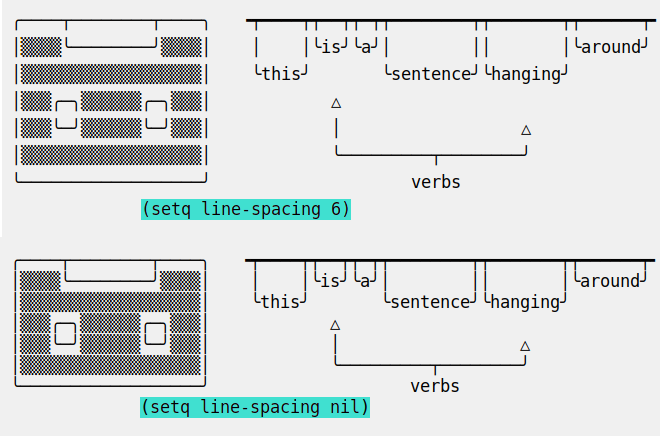

#+begin_example

 ╭────┬────────┬────╮   ╺┯━━━━┯┯━━┯┯━┯┯━━━━━━━━┯┯━━━━━━━┯┯━━━━━━┯╸
 │▒▒▒▒╰────────╯▒▒▒▒│    │    │╰is╯╰a╯│        ││       │╰around╯
 │▒▒▒▒▒▒▒▒▒▒▒▒▒▒▒▒▒▒│    ╰this╯       ╰sentence╯╰hanging╯
 │▒▒▒╭─╮▒▒▒▒▒▒╭─╮▒▒▒│            △
 │▒▒▒╰─╯▒▒▒▒▒▒╰─╯▒▒▒│            │                  △
 │▒▒▒▒▒▒▒▒▒▒▒▒▒▒▒▒▒▒│            ╰─────────┬────────╯
 ╰──────────────────╯                    verbs
              (setq line-spacing nil)

#+end_example

** Font
:PROPERTIES:
:CUSTOM_ID: font
:END:

Face customization is unrelated to =Uniline=. However, =Uniline= can
assist in choosing a good font and customizing the =default= face. See
[[#which-fonts][Which fonts?]].

Type =<insert> f= to select a font just for the current =Uniline=
session. Type =*= to enter the =Emacs= customization of the =default= face
and retain your choice for future sessions.

** Upward infiniteness ∞
:PROPERTIES:
:CUSTOM_ID: upward-infiniteness-
:END:
If the variable =uniline-infinite-up↑= is:

- =t=, then the buffer grows at the top of the buffer (or at the top of
  the narrowed region), by adding empty lines as needed.

- =nil=, then the top of the buffer (or the top of the narrowed region)
  is a non-trespassable limit. This is the default, and the behaviour
  of previous versions of Uniline.

* How Uniline behaves with its environment?
:PROPERTIES:
:CUSTOM_ID: how-uniline-behaves-with-its-environment
:END:
** Language environment
:PROPERTIES:
:CUSTOM_ID: language-environment
:END:
The so called "language environment" in Emacs can cause unwanted line
breaks, like in this drawing:

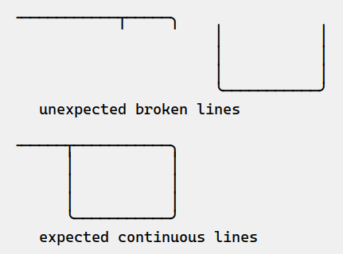

#+begin_example

  ╶───────────┬─────╮
                         │           │
                         │           │
                         │           │
                         ╰───────────╯
     unexpected broken lines

  ╶─────┬───────────╮
        │           │
        │           │
        │           │
        ╰───────────╯
     expected continuous lines

#+end_example

The above example was drawn first with the =Chinese-BIG5= language
environment, then with the =English= environment.

There is nothing specific about =Chinese-BIG5=. It is just an instance
picked out from more than 100 language environments.

#+begin_example
C-x RET l Chinese-BIG5
C-x RET l English
#+end_example

In =Chinese-BIG5=, some characters are considered twice as wide as
standard characters. Whereas in =English=, all characters needed by
Uniline are 1 unit wide.

Thanks to *rumengling* (GitHub) for discovering and diagnosing the
issue!

To workaround the issue, when entering =uniline-mode=, the width of all
characters Uniline uses is checked. If some of them are more than 1,
the =char-width-table= variable is patched.

What are the consequences of this patch? The =char-width-table= variable
is an Emacs global. Therefore the patch by Uniline will affect all
buffers. As the characters touched by the patch are graphic, and have
nothing to do with Chinese, it should not have any significance on
text written in Chinese.

It was pondered whether Uniline should put back =char-width-table= at
its original value upon exiting =uniline-mode=, or leaving the
patch. For now, it has been decided to leave it. Because anyway,
intertwining several =uniline-mode= and changes to the language
environment is intractable.

In case of something, re-setting the language environment to its same
value cancels the patch to =char-width-table= by Uniline.

** Compatibility with Picture-mode
:PROPERTIES:
:CUSTOM_ID: compatibility-with-picture-mode
:END:

=Picture-mode= and =uniline-mode= are compatible. Their features overlap
somehow:
- Both implement an unlimited buffer in east and south directions.
- Both visually truncate long lines (actual text is not truncated).
- Both set the overwrite mode (=uniline-mode= activates
  =overwrite-mode=, while =picture-mode= re-implements it)
- Both are able to draw rectangles (=uniline-mode= in UNICODE,
  =picture-mode= in ASCII), copy and yank them.

They also have features unique to each:
- =Picture-mode= writes in 8 possible directions
- =Picture-mode= handles TAB stops
- =Uniline-mode= draws lines and arrows

** Compatibility with Artist-mode
:PROPERTIES:
:CUSTOM_ID: compatibility-with-artist-mode
:END:

=Artist-mode= and =uniline-mode= are mostly incompatible. This is because
=artist-mode= preempts the arrow keys, which give access to a large part
of =uniline-mode= features.

However, it is possible to use both one after the other.

** Compatibility with Whitespace-mode
:PROPERTIES:
:CUSTOM_ID: compatibility-with-whitespace-mode
:END:

=Whitespace-mode= and =uniline-mode= are mostly compatible.

Why activate =whitespace-mode= while in =uniline-mode=? Because
=Uniline= creates a lot of white-spaces to implement an infinite
buffer. And it is funny to look at this activity.

To make =uniline-mode= and =whitespace-mode= fully compatible, disable
the newline visualization:

- =M-x customize-variable whitespace-style=
- uncheck =(Mark) NEWLINEs=

This is due to a glitch in =move-to-column= when a visual property is
attached to newlines. And =uniline-mode= makes heavy use of =move-to-column=.

** Compatibility with Org Mode
:PROPERTIES:
:CUSTOM_ID: compatibility-with-org-mode
:END:
You may want to customize the shift extension mode in =Org Mode=. This
is because =Org Mode= preempts =shift-select-mode= for other useful
purposes. Just type:

#+begin_example
M-x customize-variable org-support-shift-select
#+end_example

and choose "when outside special context", which sets it to =t=.

You then get the shift-selection from =Org Mode=, not from =Uniline=. The
difference is that the =Uniline='s one handles the infinite-ness of the
buffer.

Other than that, =Uniline= is compatible with =Org Mode=

Thanks to jdtsmith (GitHub) for sharing a funny fact he discovered. If
a source block is created with the =Uniline= language (=Uniline= is
*not* a language like =C++,= =Python=, or =Bash=), then it can be
edited (=M-x org-edit-special=) with =uniline-mode= automatically
activated.

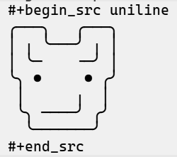

#+begin_example
#+begin_src uniline
╭───╮   ╭───╮
│ ╷ ╰───╯ ╷ │
│ ╰─    ╶─╯ │
╰╮ ●     ● ╭╯
 │      ╷  │
 ╰╮ ────╯ ╭╯
  ╰───────╯
#+end_src
#+end_example

** Org Mode and LaTex
:PROPERTIES:
:CUSTOM_ID: org-mode-and-latex
:END:
Use the =pmboxdraw= LaTex module. This gives limited support for "box
drawing" characters in LaTex documents.

Example:

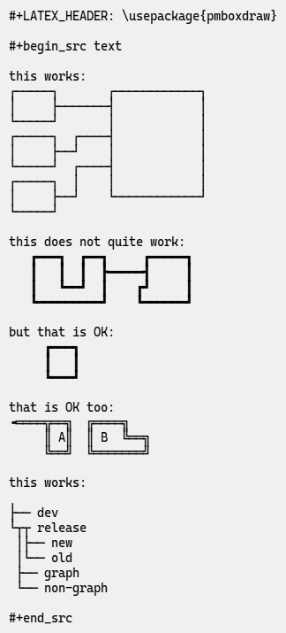

#+begin_example
#+LATEX_HEADER: \usepackage{pmboxdraw}

#+begin_src text

this works:
┌─────┐       ┌────────────┐
│     ├───────┤            │
└─────┘       │            │
┌─────┐  ┌────┤            │
│     ├──┘    │            │
└─────┘  ┌────┤            │
┌─────┐  │    │            │
│     ├──┘    └────────────┘
└─────┘

this does not quite work:
   ┏━━━┓  ┏━━┓     ┏━━━━━┓
   ┃   ┃  ┃  ┣━━━━━┫     ┃
   ┃   ┗━━┛  ┃    ┏┛     ┃
   ┗━━━━━━━━━┛    ┗━━━━━━┛

but that is OK:
     ┏━━━┓
     ┃   ┃
     ┗━━━┛

that is OK too:
╺════╦══╗  ╔════╗
     ║ A║  ║ B  ╚══╗
     ╚══╝  ╚═══════╝

this works:

├── dev
└┬┬ release
 │├── new
 │└── old
 ├── graph
 └── non-graph

#+end_src
#+end_example

Note that corners of thin lines should be sharp. There is no support
for rounded corners.

To export this Org Mode example to PDF through LaTex, type:

=C-c C-E l o=

** What about =\t= tabs?
:PROPERTIES:
:CUSTOM_ID: what-about-t-tabs
:END:
Some files may contain tabs (the character =\t=). Those include
programming code (Python, Perl, C++, D, Rust, JavaScript and so on).

When =Uniline= draws something in the middle of a TAB, or right onto a
TAB, it first converts it to spaces, then proceeds as usual. This
process is invisible. So be cautious if TABs have a special meaning in
the file.

Also, rectangles are first untabified (if there are TABs) before
moving them. This avoids some rare instances of misalignment.

One way to see what is going on, is to activate the =whitespace-mode=.

** What about =^L= page separation?
:PROPERTIES:
:CUSTOM_ID: what-about-l-page-separation
:END:
=Uniline= does not work well with =^L= (page separation)
character. Nor with similar characters, like =^T=. When trying to
draw a line over such a character, the cursor may get stuck. This is
because those characters occupy twice the width of a normal character.

Just try to get away from =^L=, =^T= and such when drawing with
=Uniline=.

** Emacs on the Linux console
:PROPERTIES:
:CUSTOM_ID: emacs-on-the-linux-console
:END:
Linux consoles are the 7 non-graphic screens which can be accessed
usually typing =C-M-F1=, =C-M-F2=, and so on. Such a screen is also
presented when connecting through =ssh= or =tls= into a non-graphical server.

By default they use a font named "Fixed" with poor support for
Unicode. However, it supports lines of the 3 types, mixing all of them
in thin lines though.

Another problem is that by default =S-<left>= and =C-<left>= are
indistinguishable from =<left>=. Same problem with =<right>=, =<up>=, =<down>=
and =<insert>=. This has nothing to do with =Emacs=. A solution can be
found here: https://www.emacswiki.org/emacs/MissingKeys

** Emacs on a graphical terminal emulator
:PROPERTIES:
:CUSTOM_ID: emacs-on-a-graphical-terminal-emulator
:END:
This is the =Emacs= launched from a terminal typing =emacs -nw=. In this
environment, =<insert>= does not exist. It is replaced by
=<insertchar>=. This has already been taken into account by =Uniline=
by duplicating the key-bindings for the two flavors of this key.

If you decide to bind globally =C-<insert>= to the toggling of
=Uniline= minor mode as suggested, then you will have to do the same
for =C-<insertchar>=, for example with =use-package= in your
=~/.emacs= file:

#+begin_src elisp
(use-package uniline
  :defer t
  :bind ("C-<insert>"     . uniline-mode)
  :bind ("C-<insertchar>" . uniline-mode))
#+end_src

** Emacs on Windows
:PROPERTIES:
:CUSTOM_ID: emacs-on-windows
:END:
On Windows the only native mono-spaced fonts are =Lucida Console= and
=Courier New=. They are not mono-spaced for the Unicodes used by
=Uniline=.

Often, the =Consolas= font is present on Windows. It supports quite well
the required Unicodes to draw lines. A few glyphs produce unaligned
result though. They should be avoided under =Consolas=: =△▶▹◆=

Of course, other fonts may be installed. It is quite easy.

** Compatibility with ASCIIFlow
:PROPERTIES:
:CUSTOM_ID: compatibility-with-asciiflow
:END:

ASCIIFlow is a ASCII-UNICODE diagram drawing tool (as Uniline). It
works on a web browser. Just open https://asciiflow.com and start
drawing. There is no server, ASCIIFlow operates locally on your
PC. Your diagrams survive web browser sessions, as they are saved
locally behind the scene.

When your drawing is complete, you can export it to Emacs-Uniline:
- Click on the download button
- Select ="ASCII Extended"=
- Paste your diagram in Emacs with =C-y=
- Modify it with Uniline

For the other way around, a Uniline drawing can be exported to
ASCIIFlow:
- Copy it from Emacs (with =M-w= for instance).
- In ASCIIFlow, choose ="Select & Move"=
- Type =C-v=
- Edit with ASCIIFlow

* Lisp API
:PROPERTIES:
:CUSTOM_ID: lisp-api
:END:
Could =Uniline= be programmed (versus used interactively)?
Yes!

The API is usable programmatically:

** Move the cursor
:PROPERTIES:
:CUSTOM_ID: move-the-cursor
:END:

Move cursor while drawing lines by calling any of the 4 directions
functions:
- =uniline-write-up↑=
- =uniline-write-ri→=
- =uniline-write-dw↓=
- =uniline-write-lf←=

They expect a repeat =count= (usually 1) and optionally =force=t= to
overwrite the buffer

** Brush
:PROPERTIES:
:CUSTOM_ID: brush
:END:

Set the current brush by calling any of the following:

- =uniline--set-brush-nil=   ;; write nothing
- =uniline--set-brush-0=     ;; eraser
- =uniline--set-brush-1=     ;; single thin line╶─╴
- =uniline--set-brush-2=     ;; single thick line╺━╸
- =uniline--set-brush-3=     ;; double line╺═╸
- =uniline--set-brush-block= ;; blocks ▙▄▟▀

Those functions are equivalent to:

- =(setq uniline--brush nil)=
- =(setq uniline--brush 0)=
- =(setq uniline--brush 1)=
- =(setq uniline--brush 2)=
- =(setq uniline--brush 3)=
- =(setq uniline--brush :block)=

except the functions also update the mode-line.

** Example: Lisp function to draw a plus sign
:PROPERTIES:
:CUSTOM_ID: example-lisp-function-to-draw-a-plus-sign
:END:
For instance, if we want to create a function to draw a "plus" sign,
we can code it as follows:

#+begin_src elisp
(defun uniline-draw-plus ()
  (interactive)
  (uniline-write-ri→ 1)
  (uniline-write-dw↓ 1)
  (uniline-write-ri→ 1)
  (uniline-write-dw↓ 1)
  (uniline-write-lf← 1)
  (uniline-write-dw↓ 1)
  (uniline-write-lf← 1)
  (uniline-write-up↑ 1)
  (uniline-write-lf← 1)
  (uniline-write-up↑ 1)
  (uniline-write-ri→ 1)
  (uniline-write-up↑ 1))
#+end_src

Calling =M-x uniline-draw-plus= will result in this nice little
plus-shape:

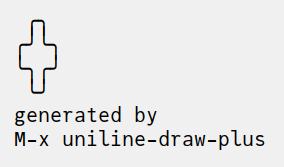

#+begin_example
   ╭╮
  ╭╯╰╮
  ╰╮╭╯
   ╰╯
  generated by
  M-x uniline-draw-plus
#+end_example

We may modify the function to accept the size of the shape as a
parameter:

#+begin_src elisp
(defun uniline-draw-plus (size)
  (interactive "Nsize? ")
  (uniline-write-ri→ size)
  (uniline-write-dw↓ size)
  (uniline-write-ri→ size)
  (uniline-write-dw↓ size)
  (uniline-write-lf← size)
  (uniline-write-dw↓ size)
  (uniline-write-lf← size)
  (uniline-write-up↑ size)
  (uniline-write-lf← size)
  (uniline-write-up↑ size)
  (uniline-write-ri→ size)
  (uniline-write-up↑ size))
#+end_src

The =(interactive "Nsize? ")= form prompts user for the size of the
shape if not given as a parameter.

This API works in any mode, not only in =Uniline= minor mode. It takes
care of the infiniteness of the buffer in the right and down
directions.

** Long range actions (contour, flood-fill, rectangle)
:PROPERTIES:
:CUSTOM_ID: long-range-actions-contour-flood-fill-rectangle
:END:

There are other useful functions operating on many characters at
once. Contour tracing and flood-filling are among them:

- =uniline-contour=
- =uniline-fill=

The following functions operate on a rectangular region, which must be
active prior to calling them:

- =uniline-draw-inner-rectangle=
- =uniline-draw-outer-rectangle=
- =uniline-copy-rectangle=
- =uniline-kill-rectangle=
- =uniline-yank-rectangle=
- =uniline-fill-rectangle=
- =uniline-move-rect-up↑=
- =uniline-move-rect-ri→=
- =uniline-move-rect-dw↓=
- =uniline-move-rect-lf←=

** Constants
:PROPERTIES:
:CUSTOM_ID: constants
:END:

Constants for the 4 directions:

- =uniline-direction-up↑= ;; constant 0
- =uniline-direction-ri→= ;; constant 1
- =uniline-direction-dw↓= ;; constant 2
- =uniline-direction-lf←= ;; constant 3

** Macro and text direction
:PROPERTIES:
:CUSTOM_ID: macro-and-text-direction
:END:

Changing text direction:

- =uniline-text-direction-up↑=
- =uniline-text-direction-ri→=
- =uniline-text-direction-dw↓=
- =uniline-text-direction-lf←=

or (in this case the mode-line is not updated):

- =(setq uniline-text-direction uniline-direction-up↑)=
- =(setq uniline-text-direction uniline-direction-ri→)=
- =(setq uniline-text-direction uniline-direction-dw↓)=
- =(setq uniline-text-direction uniline-direction-lf←)=

Call macro in any direction:

- =uniline-call-macro-in-direction-up↑=
- =uniline-call-macro-in-direction-ri→=
- =uniline-call-macro-in-direction-dw↓=
- =uniline-call-macro-in-direction-lf←=

** Insert and tweak glyphs
:PROPERTIES:
:CUSTOM_ID: insert-and-tweak-glyphs
:END:

Insert and cycle intersection glyphs:

- =uniline-insert-fw-arrow=
- =uniline-insert-fw-square=
- =uniline-insert-fw-oshape=
- =uniline-insert-fw-cross=
- =uniline-insert-fw-grey=
- =uniline-insert-bw-arrow=
- =uniline-insert-bw-square=
- =uniline-insert-bw-oshape=
- =uniline-insert-bw-cross=
- =uniline-insert-bw-grey=

Rotate arrow or tweak 4-half-lines or 4-block characters:

- =uniline-rotate-up↑=
- =uniline-rotate-ri→=
- =uniline-rotate-dw↓=
- =uniline-rotate-lf←=

Here are the lowest level functions. Move point, possibly extending
the buffer in right and bottom directions:

- =uniline-move-to-column=
- =uniline-move-to-line=
- =uniline-move-to-lin-col=
- =uniline-move-to-delta-column=
- =uniline-move-to-delta-line=

** Change to alternate styles
:PROPERTIES:
:CUSTOM_ID: change-to-alternate-styles
:END:

A drawing in a rectangular selection may have its style changed:

- =uniline-change-style-dot-3-2=      ;; 3 dashes vert. ┆, 2 horiz. ╌
- =uniline-change-style-dot-4-4=      ;; 4 dashes vert. ┊ & horiz. ┈
- =uniline-change-style-standard=     ;; back to Uniline base style
- =uniline-change-style-hard-corners= ;; rounded corners╭╴become hard┌
- =uniline-change-style-thin=         ;; convert to ╭╴ thin lines
- =uniline-change-style-thick=        ;; convert to ┏╸ thick lines
- =uniline-change-style-double=       ;; convert to ╔═ thick lines
- =uniline-aa2u-rectangle=            ;; call aa2u to convert ASCII to Unicode

The above functions require a region to be marked.

* Mouse support
:PROPERTIES:
:CUSTOM_ID: mouse-support
:END:
The out-of-the-box mouse support of =Emacs= works perfectly. Except when
the mouse clicks on a position outside the buffer. This happens when
clicking past the end of a too short line, or past the end of the buffer.

To handle those cases, a few standard =Emacs= functions have been
extended to add blank characters or blank lines. Doing so, the
mouse-click now falls on a valid part of the buffer. Of course, those
extensions are only active on =uniline-mode= activated buffers.

Beware that when the window is at the same time zoomed with =C-x C-+
C--= AND horizontally scrolled with =C-x <=, the cursor positioning is
not accurate. This is due to =Emacs= limitations and bugs. Just click
twice to fix the inaccuracy.

* Installation
:PROPERTIES:
:CUSTOM_ID: installation
:END:

** use-package, the straightforward way
:PROPERTIES:
:CUSTOM_ID: use-package-the-straightforward-way
:END:

The =use-package= library became the de-facto standard to manage
packages in your =.emacs= initialization file. The =use-package= library
comes along with Emacs. It can (among other services) delay loading
external packages until they are used, and bind keyboard shortcuts to
the package's entry points.

Add the following lines to your =.emacs= file, and reload it, if not
already done. This says that the popular Melpa repository is one of
the central store of third parties packages. To day, it provides almost
7000 packages to choose from.

#+begin_src elisp
(add-to-list 'package-archives
             '("melpa" . "http://melpa.org/packages/")
             t)
(package-initialize)
#+end_src

Alternately you may customize this variable:

#+begin_example
M-x customize-variable package-archives
#+end_example

Then add those lines in your Emacs initialization file (usually =~/.emacs=):

#+begin_src elisp
(use-package uniline-hydra
  :bind ("C-<insert>" . uniline-mode))
#+end_src

or:

#+begin_src elisp
(use-package uniline-transient
  :bind ("C-<insert>" . uniline-mode))
#+end_src

This tell Emacs:
- Be prepared to load =uniline-mode= when the user request it, but do
  not load it now.
- Bind the =C-<insert>= keys to the function =uniline-mode=. This shortens
  the longer =M-x uniline-mode= command. Any other key combinations can
  be bound, as you prefer. =<insert>= happens to also be the key used
  inside =Uniline= (customizable).
- Load either the =uniline-hydra= or the =uniline-transient= file, as you
  prefer. This gives Uniline one or the other flavour of
  user-interface.

There is an alias to =uniline-hydra=:

#+begin_src elisp
(use-package uniline
  :bind ("C-<insert>" . uniline-mode))
#+end_src

If you are using [[https://github.com/radian-software/straight.el][straight.el]] with =use-package=, and have
=(setq straight-use-package-by-default t)=, you have the following options:

#+begin_src elisp
;; uniline-hydra using the alias
(use-package uniline)

;;; uniline-hydra explicitly requested
(use-package uniline-hydra
  :straight uniline)

;;; install and load uniline-transient
(use-package uniline-transient
  :straight uniline)
#+end_src

** Without use-package
:PROPERTIES:
:CUSTOM_ID: without-use-package
:END:
Download the package from Melpa:

#+begin_src elisp
(package-install "uniline")
#+end_src

Alternately, you can download the Lisp files, and load them manually:

#+begin_src elisp
(load-file "uniline-hydra.el")   ;; interpreted form
(load-file "uniline-hydra.elc")  ;; byte-compiled form
(load-file "uniline-hydra.eln")  ;; native-compiled form
;; this automatically
;; loads "uniline-core.el"
;; or    "uniline-core.elc"
;; or    "uniline-core.eln"
#+end_src

or if you prefer the Transient interface over the Hydra one:
#+begin_src elisp
(load-file "uniline-transient.el")   ;; interpreted form
(load-file "uniline-transient.elc")  ;; byte-compiled form
(load-file "uniline-transient.eln")  ;; native-compiled form
;; this automatically
;; loads "uniline-core.el"
;; or    "uniline-core.elc"
;; or    "uniline-core.eln"
#+end_src

You should prefer the byte-compiled or native-compiled forms over the
interpreted forms, because there are a lot of optimizations performed
at compile time.

You may want to give =uniline-mode= a key-binding. A way to do that
without =use-package= is to add those lines to your initialization file
(usually =~/.emacs=):

#+begin_src elisp
(require 'uniline-hydra)
(bind-keys :package uniline-hydra ("C-<insert>" . uniline-mode))
#+end_src

The downside is that =Uniline= will be loaded as soon as =Emacs= is
launched, rather than deferred until invoked.

* Related packages
:PROPERTIES:
:CUSTOM_ID: related-packages
:END:

- =artist-mode=: the ASCII art mode built into =Emacs=.

- =ascii-art-to-unicode=: as the name suggest, converts ASCII drawings
  to UNICODE, giving results similar to those of =Uniline=.

- =picture-mode=: as in =Uniline=, the buffer is infinite in east & south
  directions.

- =ascii-art-to-unicode= ASCII art to UNICODE in =Emacs=. This is a
  standard ELPA package by Thien-Thi Nguyen (rest in peace). =Uniline=
  may call it to convert ASCII art drawings to equivalent
  UNICODE. =Uniline= arranges to not require a dependency on
  =ascii-art-to-unicode= by lazy evaluating a call to =aa2u=.

- =org-pretty-table=: Org Mode tables /appear/ to be drawn in UNICODE
  characters (actually they are still in ASCII).

- =boxes=: draws artistic boxes around text, with nice looking unicorns,
  flowers, parchments, all in ASCII art.

- =org-drawio=: a bridge between the Draw.Io editor and =Emacs=, producing
  drawing similar to those of =Uniline=, but in =.svg=.

- =syntree=: draws ASCII trees on-the-fly from description.

- =unicode-enbox=: create a UNICODE box around a text; input and output
  are strings.

- =unicode-fonts=: in =Emacs=, helps alleviate the lack of full UNICODE
  coverage of most fonts.

- =org-superstar=: prettify headings and plain lists in Org Mode, using
  UNICODE glyphs.

- =charmap=: UNICODE table viewer for =Emacs=.

- =insert-char-preview=: insert UNICODEs with character preview in
  completion prompt.

- =list-unicode-display=: list all UNICODE characters, or a selection of
  them.

- =show-font=: show font features in a buffer.

- =ob-svgbob=: convert your ascii diagram scribbles into happy little
  SVG

- =el-easydraw=: a full featured SVG editor right inside your =Emacs=

- =asciiflow=: (not =Emacs=) draw on the web, then copy-paste your UNICODE text

- =ascii-draw=: like =asciiflow= with Unicodes.

- =dot-to-ascii.ggerganov.com:= (not =Emacs=) describe your schema in the
  Graphviz language, and copy-past your UNICODE text.

- =monosketch=: (not =Emacs=) draw on the web, then copy-paste your UNICODE text.

- =ibm-box-drawing-hydra.el=: keyboard interface to insert UNICODE
  box-drawing characters one at a time.

- =excalidraw.com=: inline drawing, but not in Unicode or Ascii.

- =org-excalidraw=: integrate SVG images generated by excalidraw into
  Org Mode.

- =rcd-box=: create tables surrounded by box-drawing characters from
  Lisp descriptions.

- =ob-diagram=: generate various diagrams using diagrams backend.

- =ob-mermaid=: generate Mermaid diagrams within org-mode babel.

- =quail-boxdrawing.el=: input method for box drawing characters.

- =make-box.el=: box around part of a buffer.

- =vim drawit ascii diagrams=: in Vim, in ASCII.

- =MarkDeep=: (Casual Effects): write in Markdown, render on the Web on
  the fly. Uniline may be used to author part of the Markdown source.

- =org-utf-to-xetex=: export Org-Mode utf-8 documents to various formats
  preserving smileys and other Unicode characters.

- =image-to-ascii=: turns a photo into ASCII.

- =ascii-maze-generator=: web-inline generator of mazes, with the same
  lines drawn by Uniline.

- =diagon.arthursonzogni.com=: web-inline drawing of diagrams similar to
  those that Unline enables.

- =cascii.html=: a single Html-JavaScript file to draw Unicode diagrams.

- =elm-svgbob=: think of Ditaa for converting Ascii to SVG.

- =rasciigraph=: script to plot time-series in Unicode.

- =asciichart-sharp=: another script to plot time-series in Unicode.

- =d2=, =ob-d2=: think of Mermaid to convert diagram textual descriptions
  to SVG.

- =dag-draw.el=: in Emacs program diagrams using Lisp, the output is
  Unicode.

- =https://mbork.pl/2025-11-10_ASCII_art_timeline_diagrams=: not a
  package, just an example of how easy is to draw time-series in Ascii
  with Emacs.

- =pikchr=: describe objects and their relationship in Markdown, render
  in Unicode.

- =ob-pikchr.el=: integration of =pikchr= in Emacs Org-Mode.

- =GoAT=: Go-based Text-Art to SVG refinement.

- =SvgBob=: another script to convert Ascii to SVG (like Ditaa). Written
  in Rust.

- =Durdraw=: an Ascii, Unicode and Ansi art editor for Unix-like
  systems. With colors.

- =figlet=: makes large letters out of ordinary text, in text. There is
  an Emacs integration by J. Kotta.

* Author, contributors
:PROPERTIES:
:CUSTOM_ID: author-contributors
:END:
- Thierry Banel, author

Feedback:

- Chris Rayner (@riscy), gave recommendations prior to insertion in
  MELPA

- Adam Porter (@alphapapa), suggested submitting =Uniline= to =ELPA=;
  should I?

- Joost Kremers https://github.com/joostkremers found a bug in the
  minor-mode key-binding definitions, and incompatibility with

- DogLooksGood https://github.com/DogLooksGood gave feedback on
  inserting usual characters not moving the cursor

- LuciusChen & lhindir on GitHub, arthurno1 & karthink on Reddit,
  pushed toward =Transient= as the default interface instead of =Hydra=

- karthink noted that =Transient= was now built into =Emacs=, loosening
  the dependencies conundrum, arthurno1 participated in the =Hydra= -
  =Transient= discussion

- karthink pointed to the new =Aporetic= font family, which was then
  added to the =Uniline= supported fonts

- rumengling on GitHub found and diagnosed the misaligned lines issue
  produced by some "language environments" (see [[#language-environment][Language environment]]).

- tpapp documented the installation using Straight, and fixed some
  typos.

- tskinner-oppfi (GitHub) repoted Elpaca packaging break due to a bad
  version number.

Contributors:

- JD Smith (jdtsmith on GitHub) rewrote the =:lighter= for added
   flexibility (the information in the mode-line about the state of
   =Uniline=)

- JD Smith also pointed to =#+begin_src uniline= Org Mode block
  suprising behavior (editing its content automatically switches to
  =uniline-mode=)

Utilities:

- Oleh Krehel alias abo-abo for his package =Hydra=

- The =Magit= team for the =Transient= library

- Thien-Thi Nguyen (RIP) for his package =ascii-art-to-unicode=

* License
:PROPERTIES:
:CUSTOM_ID: license
:END:
Copyright (C) 2024-2026  Thierry Banel

Uniline is free software: you can redistribute it and/or modify it under
the terms of the GNU General Public License as published by the Free
Software Foundation, either version 3 of the License, or (at your
option) any later version.

Uniline is distributed in the hope that it will be useful, but WITHOUT
ANY WARRANTY; without even the implied warranty of MERCHANTABILITY or
FITNESS FOR A PARTICULAR PURPOSE.  See the GNU General Public License
for more details.

You should have received a copy of the GNU General Public License
along with this program.  If not, see <http://www.gnu.org/licenses/>.
